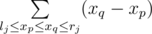

# E. Yaroslav and Points

**time limit per test:** 5 seconds

**memory limit per test:** 256 megabytes

**input:** stdin

**output:** stdout

Yaroslav has *n* points that lie on the *Ox* axis. The coordinate of the first point is *x*~1~, the coordinate of the second point is *x*~2~, ..., the coordinate of the *n*-th point is — *x*~*n*~. Now Yaroslav wants to execute *m* queries, each of them is of one of the two following types:

- Move the *p*~*j*~-th point from position *x*~*p*~*j*~~ to position *x*~*p*~*j*~~ + *d*~*j*~. At that, it is guaranteed that after executing such query all coordinates of the points will be distinct.
- Count the sum of distances between all pairs of points that lie on the segment [*l*~*j*~, *r*~*j*~] (*l*~*j*~ ≤ *r*~*j*~). In other words, you should count the sum of:



.

Help Yaroslav.

#### Input

The first line contains integer *n* — the number of points (1 ≤ *n* ≤ 10^5^). The second line contains distinct integers *x*~1~, *x*~2~, ..., *x*~*n*~ — the coordinates of points (|*x*~*i*~| ≤ 10^9^).

The third line contains integer *m* — the number of queries (1 ≤ *m* ≤ 10^5^). The next *m* lines contain the queries. The *j*-th line first contains integer *t*~*j*~ (1 ≤ *t*~*j*~ ≤ 2) — the query type. If *t*~*j*~ = 1, then it is followed by two integers *p*~*j*~ and *d*~*j*~ (1 ≤ *p*~*j*~ ≤ *n*, |*d*~*j*~| ≤ 1000). If *t*~*j*~ = 2, then it is followed by two integers *l*~*j*~ and *r*~*j*~ ( - 10^9^ ≤ *l*~*j*~ ≤ *r*~*j*~ ≤ 10^9^).

It is guaranteed that at any moment all the points have distinct coordinates.

#### Output

For each type 2 query print the answer on a single line. Print the answers in the order, in which the queries follow in the input.

Please, do not use the %lld specifier to read or write 64-bit integers in C++. It is preferred to use the cin, cout streams of the %I64d specifier.

#### Examples

#### Input
```
8
36 50 28 -75 40 -60 -95 -48
20
2 -61 29
1 5 -53
1 1 429
1 5 130
2 -101 -71
2 -69 53
1 1 404
1 5 518
2 -101 53
2 50 872
1 1 -207
2 -99 -40
1 7 -389
1 6 -171
1 2 464
1 7 -707
1 1 -730
1 1 560
2 635 644
1 7 -677
```

#### Output
```
176
20
406
1046
1638
156
0
```
