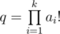

# E. Empire Strikes Back

**time limit per test:** 5 seconds

**memory limit per test:** 512 megabytes

**input:** stdin

**output:** stdout

In a far away galaxy there is war again. The treacherous Republic made *k* precision strikes of power *a*~*i*~ on the Empire possessions. To cope with the republican threat, the Supreme Council decided to deal a decisive blow to the enemy forces.

To successfully complete the conflict, the confrontation balance after the blow should be a positive integer. The balance of confrontation is a number that looks like


, where *p* = *n*! (*n* is the power of the Imperial strike),



. After many years of war the Empire's resources are low. So to reduce the costs, *n* should be a minimum positive integer that is approved by the commanders.

Help the Empire, find the minimum positive integer *n*, where the described fraction is a positive integer.

#### Input

The first line contains integer *k* (1 ≤ *k* ≤ 10^6^). The second line contains *k* integers *a*~1~, *a*~2~, ..., *a*~*k*~ (1 ≤ *a*~*i*~ ≤ 10^7^).

#### Output

Print the minimum positive integer *n*, needed for the Empire to win.

Please, do not use the %lld to read or write 64-but integers in С++. It is preferred to use the cin, cout streams or the %I64d specificator.

#### Examples

#### Input
```
2
1000 1000
```

#### Output
```
2000
```

#### Input
```
1
2
```

#### Output
```
2
```
