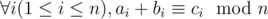
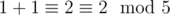
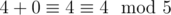
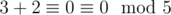
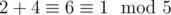
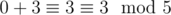

# A. Lucky Permutation Triple

**time limit per test:** 2 seconds

**memory limit per test:** 256 megabytes

**input:** stdin

**output:** stdout

Bike is interested in permutations. A permutation of length *n* is an integer sequence such that each integer from 0 to (*n* - 1) appears exactly once in it. For example, [0, 2, 1] is a permutation of length 3 while both [0, 2, 2] and [1, 2, 3] is not.

A permutation triple of permutations of length *n* (*a*, *b*, *c*) is called a Lucky Permutation Triple if and only if



. The sign *a*~*i*~ denotes the *i*-th element of permutation *a*. The modular equality described above denotes that the remainders after dividing *a*~*i*~ + *b*~*i*~ by *n* and dividing *c*~*i*~ by *n* are equal.

Now, he has an integer *n* and wants to find a Lucky Permutation Triple. Could you please help him?

#### Input

The first line contains a single integer *n* (1 ≤ *n* ≤ 10^5^).

#### Output

If no Lucky Permutation Triple of length *n* exists print -1.

Otherwise, you need to print three lines. Each line contains *n* space-seperated integers. The first line must contain permutation *a*, the second line — permutation *b*, the third — permutation *c*.

If there are multiple solutions, print any of them.

#### Examples

#### Input
```
5
```

#### Output
```
1 4 3 2 0
1 0 2 4 3
2 4 0 1 3
```

#### Input
```
2
```

#### Output
```
-1
```

#### Note

In Sample 1, the permutation triple ([1, 4, 3, 2, 0], [1, 0, 2, 4, 3], [2, 4, 0, 1, 3]) is Lucky Permutation Triple, as following holds:

-



;
-



;
-



;
-



;
-



.

In Sample 2, you can easily notice that no lucky permutation triple exists.
