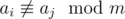

# C. Minimum Modular

**time limit per test:** 2 seconds

**memory limit per test:** 256 megabytes

**input:** stdin

**output:** stdout

You have been given *n* distinct integers *a*~1~, *a*~2~, ..., *a*~*n*~. You can remove at most *k* of them. Find the minimum modular *m* (*m* > 0), so that for every pair of the remaining integers (*a*~*i*~, *a*~*j*~), the following unequality holds:



.

#### Input

The first line contains two integers *n* and *k* (1  ≤ *n*  ≤ 5000, 0 ≤ *k* ≤ 4), which we have mentioned above.

The second line contains *n* distinct integers *a*~1~, *a*~2~, ..., *a*~*n*~ (0 ≤ *a*~*i*~ ≤ 10^6^).

#### Output

Print a single positive integer — the minimum *m*.

#### Examples

#### Input
```
7 0
0 2 3 6 7 12 18
```

#### Output
```
13
```

#### Input
```
7 1
0 2 3 6 7 12 18
```

#### Output
```
7
```
