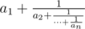
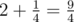
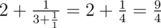
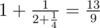

# B. Continued Fractions

**time limit per test:** 2 seconds

**memory limit per test:** 256 megabytes

**input:** stdin

**output:** stdout

A continued fraction of height *n* is a fraction of form



. You are given two rational numbers, one is represented as


 and the other one is represented as a finite fraction of height *n*. Check if they are equal.

#### Input

The first line contains two space-separated integers *p*, *q* (1 ≤ *q* ≤ *p* ≤ 10^18^) — the numerator and the denominator of the first fraction.

The second line contains integer *n* (1 ≤ *n* ≤ 90) — the height of the second fraction. The third line contains *n* space-separated integers *a*~1~, *a*~2~, ..., *a*~*n*~ (1 ≤ *a*~*i*~ ≤ 10^18^) — the continued fraction.

Please, do not use the %lld specifier to read or write 64-bit integers in С++. It is preferred to use the cin, cout streams or the %I64d specifier.

#### Output

Print "YES" if these fractions are equal and "NO" otherwise.

#### Examples

#### Input
```
9 4
2
2 4
```

#### Output
```
YES
```

#### Input
```
9 4
3
2 3 1
```

#### Output
```
YES
```

#### Input
```
9 4
3
1 2 4
```

#### Output
```
NO
```

#### Note

In the first sample



.

In the second sample



.

In the third sample



.
