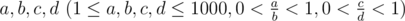

# B. Archer

**time limit per test:** 2 seconds

**memory limit per test:** 256 megabytes

**input:** stdin

**output:** stdout

SmallR is an archer. SmallR is taking a match of archer with Zanoes. They try to shoot in the target in turns, and SmallR shoots first. The probability of shooting the target each time is


 for SmallR while


 for Zanoes. The one who shoots in the target first should be the winner.

Output the probability that SmallR will win the match.

#### Input

A single line contains four integers



.

#### Output

Print a single real number, the probability that SmallR will win the match.

The answer will be considered correct if the absolute or relative error doesn't exceed 10^ - 6^.

#### Examples

#### Input
```
1 2 1 2
```

#### Output
```
0.666666666667
```
