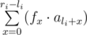

# E3. Summer Homework

**time limit per test:** 3 seconds

**memory limit per test:** 256 megabytes

**input:** stdin

**output:** stdout

By the age of three Smart Beaver mastered all arithmetic operations and got this summer homework from the amazed teacher:

You are given a sequence of integers *a*~1~, *a*~2~, ..., *a*~*n*~. Your task is to perform on it *m* consecutive operations of the following type:

- For given numbers *x*~*i*~ and *v*~*i*~ assign value *v*~*i*~ to element *a*~*x*~*i*~~.
- For given numbers *l*~*i*~ and *r*~*i*~ you've got to calculate sum



, where *f*~0~ = *f*~1~ = 1 and at *i* ≥ 2: *f*~*i*~ = *f*~*i* - 1~ + *f*~*i* - 2~.
- For a group of three numbers *l*~*i*~ *r*~*i*~ *d*~*i*~ you should increase value *a*~*x*~ by *d*~*i*~ for all *x* (*l*~*i*~ ≤ *x* ≤ *r*~*i*~).

Smart Beaver planned a tour around great Canadian lakes, so he asked you to help him solve the given problem.

#### Input

The first line contains two integers *n* and *m* (1 ≤ *n*, *m* ≤ 2·10^5^) — the number of integers in the sequence and the number of operations, correspondingly. The second line contains *n* integers *a*~1~, *a*~2~, ..., *a*~*n*~ (0 ≤ *a*~*i*~ ≤ 10^5^). Then follow *m* lines, each describes an operation. Each line starts with an integer *t*~*i*~ (1 ≤ *t*~*i*~ ≤ 3) — the operation type:

- if *t*~*i*~ = 1, then next follow two integers *x*~*i*~ *v*~*i*~ (1 ≤ *x*~*i*~ ≤ *n*, 0 ≤ *v*~*i*~ ≤ 10^5^);
- if *t*~*i*~ = 2, then next follow two integers *l*~*i*~ *r*~*i*~ (1 ≤ *l*~*i*~ ≤ *r*~*i*~ ≤ *n*);
- if *t*~*i*~ = 3, then next follow three integers *l*~*i*~ *r*~*i*~ *d*~*i*~ (1 ≤ *l*~*i*~ ≤ *r*~*i*~ ≤ *n*, 0 ≤ *d*~*i*~ ≤ 10^5^).

The input limits for scoring 30 points are (subproblem E1):

- It is guaranteed that *n* does not exceed 100, *m* does not exceed 10000 and there will be no queries of the 3-rd type.

The input limits for scoring 70 points are (subproblems E1+E2):

- It is guaranteed that there will be queries of the 1-st and 2-nd type only.

The input limits for scoring 100 points are (subproblems E1+E2+E3):

- No extra limitations.

#### Output

For each query print the calculated sum modulo 1000000000 (10^9^).

#### Examples

#### Input
```
5 5
1 3 1 2 4
2 1 4
2 1 5
2 2 4
1 3 10
2 1 5
```

#### Output
```
12
32
8
50
```

#### Input
```
5 4
1 3 1 2 4
3 1 4 1
2 2 4
1 2 10
2 1 5
```

#### Output
```
12
45
```
