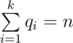

# E. Ciel and Gondolas

**time limit per test:** 4 seconds

**memory limit per test:** 512 megabytes

**input:** stdin

**output:** stdout

Fox Ciel is in the Amusement Park. And now she is in a queue in front of the Ferris wheel. There are *n* people (or foxes more precisely) in the queue: we use first people to refer one at the head of the queue, and *n*-th people to refer the last one in the queue.

There will be *k* gondolas, and the way we allocate gondolas looks like this:

- When the first gondolas come, the *q*~1~ people in head of the queue go into the gondolas.
- Then when the second gondolas come, the *q*~2~ people in head of the remain queue go into the gondolas.    ...
- The remain *q*~*k*~ people go into the last (*k*-th) gondolas.

Note that *q*~1~, *q*~2~, ..., *q*~*k*~ must be positive. You can get from the statement that



 and *q*~*i*~ > 0.

You know, people don't want to stay with strangers in the gondolas, so your task is to find an optimal allocation way (that is find an optimal sequence *q*) to make people happy. For every pair of people *i* and *j*, there exists a value *u*~*ij*~ denotes a level of unfamiliar. You can assume *u*~*ij*~ = *u*~*ji*~ for all *i*, *j* (1 ≤ *i*, *j* ≤ *n*) and *u*~*ii*~ = 0 for all *i* (1 ≤ *i* ≤ *n*). Then an unfamiliar value of a gondolas is the sum of the levels of unfamiliar between any pair of people that is into the gondolas.

A total unfamiliar value is the sum of unfamiliar values for all gondolas. Help Fox Ciel to find the minimal possible total unfamiliar value for some optimal allocation.

#### Input

The first line contains two integers *n* and *k* (1 ≤ *n* ≤ 4000 and 1 ≤ *k* ≤ *min*(*n*, 800)) — the number of people in the queue and the number of gondolas. Each of the following *n* lines contains *n* integers — matrix *u*, (0 ≤ *u*~*ij*~ ≤ 9, *u*~*ij*~ = *u*~*ji*~ and *u*~*ii*~ = 0).

Please, use fast input methods (for example, please use BufferedReader instead of Scanner for Java).

#### Output

Print an integer — the minimal possible total unfamiliar value.

#### Examples

#### Input
```
5 2
0 0 1 1 1
0 0 1 1 1
1 1 0 0 0
1 1 0 0 0
1 1 0 0 0
```

#### Output
```
0
```

#### Input
```
8 3
0 1 1 1 1 1 1 1
1 0 1 1 1 1 1 1
1 1 0 1 1 1 1 1
1 1 1 0 1 1 1 1
1 1 1 1 0 1 1 1
1 1 1 1 1 0 1 1
1 1 1 1 1 1 0 1
1 1 1 1 1 1 1 0
```

#### Output
```
7
```

#### Input
```
3 2
0 2 0
2 0 3
0 3 0
```

#### Output
```
2
```

#### Note

In the first example, we can allocate people like this: {1, 2} goes into a gondolas, {3, 4, 5} goes into another gondolas.

In the second example, an optimal solution is : {1, 2, 3} | {4, 5, 6} | {7, 8}.
