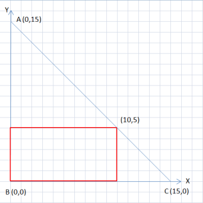

# A. Vasily the Bear and Triangle

**time limit per test:** 1 second

**memory limit per test:** 256 megabytes

**input:** stdin

**output:** stdout

Vasily the bear has a favorite rectangle, it has one vertex at point (0, 0), and the opposite vertex at point (*x*, *y*). Of course, the sides of Vasya's favorite rectangle are parallel to the coordinate axes.

Vasya also loves triangles, if the triangles have one vertex at point *B* = (0, 0). That's why today he asks you to find two points *A* = (*x*~1~, *y*~1~) and *C* = (*x*~2~, *y*~2~), such that the following conditions hold:

- the coordinates of points: *x*~1~, *x*~2~, *y*~1~, *y*~2~ are integers. Besides, the following inequation holds: *x*~1~ < *x*~2~;
- the triangle formed by point *A*, *B* and *C* is rectangular and isosceles (


 is right);
- all points of the favorite rectangle are located inside or on the border of triangle *ABC*;
- the area of triangle *ABC* is as small as possible.

Help the bear, find the required points. It is not so hard to proof that these points are unique.

#### Input

The first line contains two integers *x*, *y* ( - 10^9^ ≤ *x*, *y* ≤ 10^9^, *x* ≠ 0, *y* ≠ 0).

#### Output

Print in the single line four integers *x*~1~, *y*~1~, *x*~2~, *y*~2~ — the coordinates of the required points.

#### Examples

#### Input
```
10 5
```

#### Output
```
0 15 15 0
```

#### Input
```
-10 5
```

#### Output
```
-15 0 0 15
```

#### Note



Figure to the first sample
