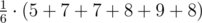
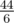
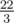

# C. Tourist Problem

**time limit per test:** 1 second

**memory limit per test:** 256 megabytes

**input:** stdin

**output:** stdout

Iahub is a big fan of tourists. He wants to become a tourist himself, so he planned a trip. There are *n* destinations on a straight road that Iahub wants to visit. Iahub starts the excursion from kilometer 0. The *n* destinations are described by a non-negative integers sequence *a*~1~, *a*~2~, ..., *a*~*n*~. The number *a*~*k*~ represents that the *k*th destination is at distance *a*~*k*~ kilometers from the starting point. No two destinations are located in the same place.

Iahub wants to visit each destination only once. Note that, crossing through a destination is not considered visiting, unless Iahub explicitly wants to visit it at that point. Also, after Iahub visits his last destination, he doesn't come back to kilometer 0, as he stops his trip at the last destination.

The distance between destination located at kilometer *x* and next destination, located at kilometer *y*, is |*x* - *y*| kilometers. We call a "route" an order of visiting the destinations. Iahub can visit destinations in any order he wants, as long as he visits all *n* destinations and he doesn't visit a destination more than once.

Iahub starts writing out on a paper all possible routes and for each of them, he notes the total distance he would walk. He's interested in the average number of kilometers he would walk by choosing a route. As he got bored of writing out all the routes, he asks you to help him.

#### Input

The first line contains integer *n* (2 ≤ *n* ≤ 10^5^). Next line contains *n* distinct integers *a*~1~, *a*~2~, ..., *a*~*n*~ (1 ≤ *a*~*i*~ ≤ 10^7^).

#### Output

Output two integers — the numerator and denominator of a fraction which is equal to the wanted average number. The fraction must be irreducible.

#### Examples

#### Input
```
3
2 3 5
```

#### Output
```
22 3
```

#### Note

Consider 6 possible routes:

- [2, 3, 5]: total distance traveled: |2 – 0| + |3 – 2| + |5 – 3| = 5;
- [2, 5, 3]: |2 – 0| + |5 – 2| + |3 – 5| = 7;
- [3, 2, 5]: |3 – 0| + |2 – 3| + |5 – 2| = 7;
- [3, 5, 2]: |3 – 0| + |5 – 3| + |2 – 5| = 8;
- [5, 2, 3]: |5 – 0| + |2 – 5| + |3 – 2| = 9;
- [5, 3, 2]: |5 – 0| + |3 – 5| + |2 – 3| = 8.

The average travel distance is



 =



 =



.
