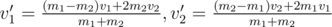

# E. Collisions

**time limit per test:** 2 seconds

**memory limit per test:** 256 megabytes

**input:** stdin

**output:** stdout

On a number line there are *n* balls. At time moment 0 for each ball the following data is known: its coordinate *x*~*i*~, speed *v*~*i*~ (possibly, negative) and weight *m*~*i*~. The radius of the balls can be ignored.

The balls collide elastically, i.e. if two balls weighing *m*~1~ and *m*~2~ and with speeds *v*~1~ and *v*~2~ collide, their new speeds will be:



.
Your task is to find out, where each ball will be *t* seconds after.

#### Input

The first line contains two integers *n* and *t* (1 ≤ *n* ≤ 10, 0 ≤ *t* ≤ 100) — amount of balls and duration of the process. Then follow *n* lines, each containing three integers: *x*~*i*~, *v*~*i*~, *m*~*i*~ (1 ≤ |*v*~*i*~|, *m*~*i*~ ≤ 100, |*x*~*i*~| ≤ 100) — coordinate, speed and weight of the ball with index *i* at time moment 0.

It is guaranteed that no two balls have the same coordinate initially. Also each collision will be a collision of not more than two balls (that is, three or more balls never collide at the same point in all times from segment [0;*t*]).

#### Output

Output *n* numbers — coordinates of the balls *t* seconds after. Output the numbers accurate to at least 4 digits after the decimal point.

#### Examples

#### Input
```
2 9
3 4 5
0 7 8
```

#### Output
```
68.538461538
44.538461538
```

#### Input
```
3 10
1 2 3
4 -5 6
7 -8 9
```

#### Output
```
-93.666666667
-74.666666667
-15.666666667
```
