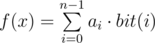
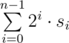
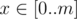

# C. Find Maximum

**time limit per test:** 1 second

**memory limit per test:** 256 megabytes

**input:** stdin

**output:** stdout

Valera has array *a*, consisting of *n* integers *a*~0~, *a*~1~, ..., *a*~*n* - 1~, and function *f*(*x*), taking an integer from 0 to 2^*n*^ - 1 as its single argument. Value *f*(*x*) is calculated by formula



, where value *bit*(*i*) equals one if the binary representation of number *x* contains a 1 on the *i*-th position, and zero otherwise.

For example, if *n* = 4 and *x* = 11 (11 = 2^0^ + 2^1^ + 2^3^), then *f*(*x*) = *a*~0~ + *a*~1~ + *a*~3~.

Help Valera find the maximum of function *f*(*x*) among all *x*, for which an inequality holds: 0 ≤ *x* ≤ *m*.

#### Input

The first line contains integer *n* (1 ≤ *n* ≤ 10^5^) — the number of array elements. The next line contains *n* space-separated integers *a*~0~, *a*~1~, ..., *a*~*n* - 1~ (0 ≤ *a*~*i*~ ≤ 10^4^) — elements of array *a*.

The third line contains a sequence of digits zero and one without spaces *s*~0~*s*~1~... *s*~*n* - 1~ — the binary representation of number *m*. Number *m* equals



.

#### Output

Print a single integer — the maximum value of function *f*(*x*) for all



.

#### Examples

#### Input
```
2
3 8
10
```

#### Output
```
3
```

#### Input
```
5
17 0 10 2 1
11010
```

#### Output
```
27
```

#### Note

In the first test case *m* = 2^0^ = 1, *f*(0) = 0, *f*(1) = *a*~0~ = 3.

In the second sample *m* = 2^0^ + 2^1^ + 2^3^ = 11, the maximum value of function equals *f*(5) = *a*~0~ + *a*~2~ = 17 + 10 = 27.
