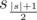
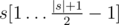
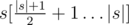

# E. Xenia and String Problem

**time limit per test:** 1 second

**memory limit per test:** 256 megabytes

**input:** stdin

**output:** stdout

Xenia the coder went to The Olympiad of Informatics and got a string problem. Unfortunately, Xenia isn't fabulous in string algorithms. Help her solve the problem.

String *s* is a sequence of characters *s*~1~*s*~2~... *s*~|*s*|~, where record |*s*| shows the length of the string.

Substring *s*[*i*... *j*] of string *s* is string *s*~*i*~*s*~*i* + 1~... *s*~*j*~.

String *s* is a Gray string, if it meets the conditions:

- the length of string |*s*| is odd;
- character



 occurs exactly once in the string;
- either |*s*| = 1, or substrings



 and



 are the same and are Gray strings.

For example, strings "abacaba", "xzx", "g" are Gray strings and strings "aaa", "xz", "abaxcbc" are not.

The beauty of string *p* is the sum of the squares of the lengths of all substrings of string *p* that are Gray strings. In other words, consider all pairs of values *i*, *j* (1 ≤ *i* ≤ *j* ≤ |*p*|). If substring *p*[*i*... *j*] is a Gray string, you should add (*j* - *i* + 1)^2^ to the beauty.

Xenia has got string *t* consisting of lowercase English letters. She is allowed to replace at most one letter of the string by any other English letter. The task is to get a string of maximum beauty.

#### Input

The first line contains a non-empty string *t* (1 ≤ |*t*| ≤ 10^5^). String *t* only consists of lowercase English letters.

#### Output

Print the sought maximum beauty value Xenia can get.

Please do not use the %lld specifier to read or write 64-bit integers in С++. It is preferred to use the cin, cout streams or the %I64d specifier.

#### Examples

#### Input
```
zzz
```

#### Output
```
12
```

#### Input
```
aba
```

#### Output
```
12
```

#### Input
```
abacaba
```

#### Output
```
83
```

#### Input
```
aaaaaa
```

#### Output
```
15
```

#### Note

In the first test sample the given string can be transformed into string *p* = "zbz". Such string contains Gray strings as substrings *p*[1... 1], *p*[2... 2], *p*[3... 3] и *p*[1... 3]. In total, the beauty of string *p* gets equal to 1^2^ + 1^2^ + 1^2^ + 3^2^ = 12. You can't obtain a more beautiful string.

In the second test case it is not necessary to perform any operation. The initial string has the maximum possible beauty.
