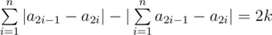

# B. Permutation

**time limit per test:** 1 second

**memory limit per test:** 256 megabytes

**input:** stdin

**output:** stdout

A permutation *p* is an ordered group of numbers *p*~1~,   *p*~2~,   ...,   *p*~*n*~, consisting of *n* distinct positive integers, each is no more than *n*. We'll define number *n* as the length of permutation *p*~1~,   *p*~2~,   ...,   *p*~*n*~.

Simon has a positive integer *n* and a non-negative integer *k*, such that 2*k* ≤ *n*. Help him find permutation *a* of length 2*n*, such that it meets this equation:



.

#### Input

The first line contains two integers *n* and *k* (1 ≤ *n* ≤ 50000, 0 ≤ 2*k* ≤ *n*).

#### Output

Print 2*n* integers *a*~1~, *a*~2~, ..., *a*~2*n*~ — the required permutation *a*. It is guaranteed that the solution exists. If there are multiple solutions, you can print any of them.

#### Examples

#### Input
```
1 0
```

#### Output
```
1 2
```

#### Input
```
2 1
```

#### Output
```
3 2 1 4
```

#### Input
```
4 0
```

#### Output
```
2 7 4 6 1 3 5 8
```

#### Note

Record |*x*| represents the absolute value of number *x*.

In the first sample |1 - 2| - |1 - 2| = 0.

In the second sample |3 - 2| + |1 - 4| - |3 - 2 + 1 - 4| = 1 + 3 - 2 = 2.

In the third sample |2 - 7| + |4 - 6| + |1 - 3| + |5 - 8| - |2 - 7 + 4 - 6 + 1 - 3 + 5 - 8| = 12 - 12 = 0.
