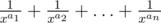
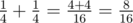
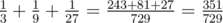
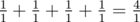

# C. Prime Number

**time limit per test:** 1 second

**memory limit per test:** 256 megabytes

**input:** stdin

**output:** stdout

Simon has a prime number *x* and an array of non-negative integers *a*~1~, *a*~2~, ..., *a*~*n*~.

Simon loves fractions very much. Today he wrote out number



 on a piece of paper. After Simon led all fractions to a common denominator and summed them up, he got a fraction:


, where number *t* equals *x*^*a*~1~ + *a*~2~ + ... + *a*~*n*~^. Now Simon wants to reduce the resulting fraction.

Help him, find the greatest common divisor of numbers *s* and *t*. As GCD can be rather large, print it as a remainder after dividing it by number 1000000007 (10^9^ + 7).

#### Input

The first line contains two positive integers *n* and *x* (1 ≤ *n* ≤ 10^5^, 2 ≤ *x* ≤ 10^9^) — the size of the array and the prime number.

The second line contains *n* space-separated integers *a*~1~, *a*~2~, ..., *a*~*n*~ (0 ≤ *a*~1~ ≤ *a*~2~ ≤ ... ≤ *a*~*n*~ ≤ 10^9^).

#### Output

Print a single number — the answer to the problem modulo 1000000007 (10^9^ + 7).

#### Examples

#### Input
```
2 2
2 2
```

#### Output
```
8
```

#### Input
```
3 3
1 2 3
```

#### Output
```
27
```

#### Input
```
2 2
29 29
```

#### Output
```
73741817
```

#### Input
```
4 5
0 0 0 0
```

#### Output
```
1
```

#### Note

In the first sample



. Thus, the answer to the problem is 8.

In the second sample,



. The answer to the problem is 27, as 351 = 13·27, 729 = 27·27.

In the third sample the answer to the problem is 1073741824 *mod* 1000000007 = 73741817.

In the fourth sample



. Thus, the answer to the problem is 1.
