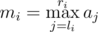

# A. Levko and Array Recovery

**time limit per test:** 1 second

**memory limit per test:** 256 megabytes

**input:** stdin

**output:** stdout

Levko loves array *a*~1~, *a*~2~, ... , *a*~*n*~, consisting of integers, very much. That is why Levko is playing with array *a*, performing all sorts of operations with it. Each operation Levko performs is of one of two types:

- Increase all elements from *l*~*i*~ to *r*~*i*~ by *d*~*i*~. In other words, perform assignments *a*~*j*~ = *a*~*j*~ + *d*~*i*~ for all *j* that meet the inequation *l*~*i*~ ≤ *j* ≤ *r*~*i*~.
- Find the maximum of elements from *l*~*i*~ to *r*~*i*~. That is, calculate the value



.

Sadly, Levko has recently lost his array. Fortunately, Levko has records of all operations he has performed on array *a*. Help Levko, given the operation records, find at least one suitable array. The results of all operations for the given array must coincide with the record results. Levko clearly remembers that all numbers in his array didn't exceed 10^9^ in their absolute value, so he asks you to find such an array.

#### Input

The first line contains two integers *n* and *m* (1 ≤ *n*, *m* ≤ 5000) — the size of the array and the number of operations in Levko's records, correspondingly.

Next *m* lines describe the operations, the *i*-th line describes the *i*-th operation. The first integer in the *i*-th line is integer *t*~*i*~ (1 ≤ *t*~*i*~ ≤ 2) that describes the operation type. If *t*~*i*~ = 1, then it is followed by three integers *l*~*i*~, *r*~*i*~ and *d*~*i*~ (1 ≤ *l*~*i*~ ≤ *r*~*i*~ ≤ *n*,  - 10^4^ ≤ *d*~*i*~ ≤ 10^4^) — the description of the operation of the first type. If *t*~*i*~ = 2, then it is followed by three integers *l*~*i*~, *r*~*i*~ and *m*~*i*~ (1 ≤ *l*~*i*~ ≤ *r*~*i*~ ≤ *n*,  - 5·10^7^ ≤ *m*~*i*~ ≤ 5·10^7^) — the description of the operation of the second type.

The operations are given in the order Levko performed them on his array.

#### Output

In the first line print "YES" (without the quotes), if the solution exists and "NO" (without the quotes) otherwise.

If the solution exists, then on the second line print *n* integers *a*~1~, *a*~2~, ... , *a*~*n*~ (|*a*~*i*~| ≤ 10^9^) — the recovered array.

#### Examples

#### Input
```
4 5
1 2 3 1
2 1 2 8
2 3 4 7
1 1 3 3
2 3 4 8
```

#### Output
```
YES
4 7 4 7
```

#### Input
```
4 5
1 2 3 1
2 1 2 8
2 3 4 7
1 1 3 3
2 3 4 13
```

#### Output
```
NO
```
