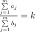
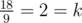

# C. Dima and Salad

**time limit per test:** 1 second

**memory limit per test:** 256 megabytes

**input:** stdin

**output:** stdout

Dima, Inna and Seryozha have gathered in a room. That's right, someone's got to go. To cheer Seryozha up and inspire him to have a walk, Inna decided to cook something.

Dima and Seryozha have *n* fruits in the fridge. Each fruit has two parameters: the taste and the number of calories. Inna decided to make a fruit salad, so she wants to take some fruits from the fridge for it. Inna follows a certain principle as she chooses the fruits: the total taste to the total calories ratio of the chosen fruits must equal *k*. In other words,



 , where *a*~*j*~ is the taste of the *j*-th chosen fruit and *b*~*j*~ is its calories.

Inna hasn't chosen the fruits yet, she is thinking: what is the maximum taste of the chosen fruits if she strictly follows her principle? Help Inna solve this culinary problem — now the happiness of a young couple is in your hands!

Inna loves Dima very much so she wants to make the salad from at least one fruit.

#### Input

The first line of the input contains two integers *n*, *k* (1 ≤ *n* ≤ 100, 1 ≤ *k* ≤ 10). The second line of the input contains *n* integers *a*~1~, *a*~2~, ..., *a*~*n*~ (1 ≤ *a*~*i*~ ≤ 100) — the fruits' tastes. The third line of the input contains *n* integers *b*~1~, *b*~2~, ..., *b*~*n*~ (1 ≤ *b*~*i*~ ≤ 100) — the fruits' calories. Fruit number *i* has taste *a*~*i*~ and calories *b*~*i*~.

#### Output

If there is no way Inna can choose the fruits for the salad, print in the single line number -1. Otherwise, print a single integer — the maximum possible sum of the taste values of the chosen fruits.

#### Examples

#### Input
```
3 2
10 8 1
2 7 1
```

#### Output
```
18
```

#### Input
```
5 3
4 4 4 4 4
2 2 2 2 2
```

#### Output
```
-1
```

#### Note

In the first test sample we can get the total taste of the fruits equal to 18 if we choose fruit number 1 and fruit number 2, then the total calories will equal 9. The condition



 fulfills, that's exactly what Inna wants.

In the second test sample we cannot choose the fruits so as to follow Inna's principle.
