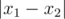
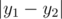

# E. Dima and Magic Guitar

**time limit per test:** 3 seconds

**memory limit per test:** 256 megabytes

**input:** stdin

**output:** stdout

Dima loves Inna very much. He decided to write a song for her. Dima has a magic guitar with *n* strings and *m* frets. Dima makes the guitar produce sounds like that: to play a note, he needs to hold one of the strings on one of the frets and then pull the string. When Dima pulls the *i*-th string holding it on the *j*-th fret the guitar produces a note, let's denote it as *a*~*ij*~. We know that Dima's guitar can produce *k* distinct notes. It is possible that some notes can be produced in multiple ways. In other words, it is possible that *a*~*ij*~ = *a*~*pq*~ at (*i*, *j*) ≠ (*p*, *q*).

Dima has already written a song — a sequence of *s* notes. In order to play the song, you need to consecutively produce the notes from the song on the guitar. You can produce each note in any available way. Dima understood that there are many ways to play a song and he wants to play it so as to make the song look as complicated as possible (try to act like Cobein).

We'll represent a way to play a song as a sequence of pairs (*x*~*i*~, *y*~*i*~) (1 ≤ *i* ≤ *s*), such that the *x*~*i*~-th string on the *y*~*i*~-th fret produces the *i*-th note from the song. The complexity of moving between pairs (*x*~1~, *y*~1~) and (*x*~2~, *y*~2~) equals



 +



. The complexity of a way to play a song is the maximum of complexities of moving between adjacent pairs.

Help Dima determine the maximum complexity of the way to play his song! The guy's gotta look cool!

#### Input

The first line of the input contains four integers *n*, *m*, *k* and *s* (1 ≤ *n*, *m* ≤ 2000, 1 ≤ *k* ≤ 9, 2 ≤ *s* ≤ 10^5^).

Then follow *n* lines, each containing *m* integers *a*~*ij*~ (1 ≤ *a*~*ij*~ ≤ *k*). The number in the *i*-th row and the *j*-th column (*a*~*ij*~) means a note that the guitar produces on the *i*-th string and the *j*-th fret.

The last line of the input contains *s* integers *q*~*i*~ (1 ≤ *q*~*i*~ ≤ *k*) — the sequence of notes of the song.

#### Output

In a single line print a single number — the maximum possible complexity of the song.

#### Examples

#### Input
```
4 6 5 7
3 1 2 2 3 1
3 2 2 2 5 5
4 2 2 2 5 3
3 2 2 1 4 3
2 3 1 4 1 5 1
```

#### Output
```
8
```

#### Input
```
4 4 9 5
4 7 9 5
1 2 1 7
8 3 4 9
5 7 7 2
7 1 9 2 5
```

#### Output
```
4
```
