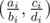

# E. Drawing Circles is Fun

**time limit per test:** 3 seconds

**memory limit per test:** 256 megabytes

**input:** stdin

**output:** stdout

There are a set of points *S* on the plane. This set doesn't contain the origin *O*(0, 0), and for each two distinct points in the set *A* and *B*, the triangle *OAB* has strictly positive area.

Consider a set of pairs of points (*P*~1~, *P*~2~), (*P*~3~, *P*~4~), ..., (*P*~2*k* - 1~, *P*~2*k*~). We'll call the set good if and only if:

- *k* ≥ 2.
- All *P*~*i*~ are distinct, and each *P*~*i*~ is an element of *S*.
- For any two pairs (*P*~2*i* - 1~, *P*~2*i*~) and (*P*~2*j* - 1~, *P*~2*j*~), the circumcircles of triangles *OP*~2*i* - 1~*P*~2*j* - 1~ and *OP*~2*i*~*P*~2*j*~ have a single common point, and the circumcircle of triangles *OP*~2*i* - 1~*P*~2*j*~ and *OP*~2*i*~*P*~2*j* - 1~ have a single common point.

Calculate the number of good sets of pairs modulo 1000000007 (10^9^ + 7).

#### Input

The first line contains a single integer *n* (1 ≤ *n* ≤ 1000) — the number of points in *S*. Each of the next *n* lines contains four integers *a*~*i*~, *b*~*i*~, *c*~*i*~, *d*~*i*~ (0 ≤ |*a*~*i*~|, |*c*~*i*~| ≤ 50; 1 ≤ *b*~*i*~, *d*~*i*~ ≤ 50; (*a*~*i*~, *c*~*i*~) ≠ (0, 0)). These integers represent a point



.

No two points coincide.

#### Output

Print a single integer — the answer to the problem modulo 1000000007 (10^9^ + 7).

#### Examples

#### Input
```
10
-46 46 0 36
0 20 -24 48
-50 50 -49 49
-20 50 8 40
-15 30 14 28
4 10 -4 5
6 15 8 10
-20 50 -3 15
4 34 -16 34
16 34 2 17
```

#### Output
```
2
```

#### Input
```
10
30 30 -26 26
0 15 -36 36
-28 28 -34 34
10 10 0 4
-8 20 40 50
9 45 12 30
6 15 7 35
36 45 -8 20
-16 34 -4 34
4 34 8 17
```

#### Output
```
4
```

#### Input
```
10
0 20 38 38
-30 30 -13 13
-11 11 16 16
30 30 0 37
6 30 -4 10
6 15 12 15
-4 5 -10 25
-16 20 4 10
8 17 -2 17
16 34 2 17
```

#### Output
```
10
```
