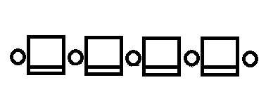

# D. Sereja and Cinema

**time limit per test:** 1 second

**memory limit per test:** 256 megabytes

**input:** stdin

**output:** stdout

The cinema theater hall in Sereja's city is *n* seats lined up in front of one large screen. There are slots for personal possessions to the left and to the right of each seat. Any two adjacent seats have exactly one shared slot. The figure below shows the arrangement of seats and slots for *n* = 4.





Today it's the premiere of a movie called "Dry Hard". The tickets for all the seats have been sold. There is a very strict controller at the entrance to the theater, so all *n* people will come into the hall one by one. As soon as a person enters a cinema hall, he immediately (momentarily) takes his seat and occupies all empty slots to the left and to the right from him. If there are no empty slots, the man gets really upset and leaves.

People are not very constant, so it's hard to predict the order in which the viewers will enter the hall. For some seats, Sereja knows the number of the viewer (his number in the entering queue of the viewers) that will come and take this seat. For others, it can be any order.

Being a programmer and a mathematician, Sereja wonders: how many ways are there for the people to enter the hall, such that nobody gets upset? As the number can be quite large, print it modulo 1000000007 (10^9^ + 7).

#### Input

The first line contains integer *n* (1 ≤ *n* ≤ 10^5^). The second line contains *n* integers, the *i*-th integer shows either the index of the person (index in the entering queue) with the ticket for the *i*-th seat or a 0, if his index is not known. It is guaranteed that all positive numbers in the second line are distinct.

You can assume that the index of the person who enters the cinema hall is a unique integer from 1 to *n*. The person who has index 1 comes first to the hall, the person who has index 2 comes second and so on.

#### Output

In a single line print the remainder after dividing the answer by number 1000000007 (10^9^ + 7).

#### Examples

#### Input
```
11
0 0 0 0 0 0 0 0 0 0 0
```

#### Output
```
1024
```

#### Input
```
6
0 3 1 0 0 0
```

#### Output
```
3
```
