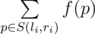

# C. Bear and Prime Numbers

**time limit per test:** 2 seconds

**memory limit per test:** 512 megabytes

**input:** stdin

**output:** stdout

Recently, the bear started studying data structures and faced the following problem.

You are given a sequence of integers *x*~1~, *x*~2~, ..., *x*~*n*~ of length *n* and *m* queries, each of them is characterized by two integers *l*~*i*~, *r*~*i*~. Let's introduce *f*(*p*) to represent the number of such indexes *k*, that *x*~*k*~ is divisible by *p*. The answer to the query *l*~*i*~, *r*~*i*~ is the sum:



, where *S*(*l*~*i*~, *r*~*i*~) is a set of prime numbers from segment [*l*~*i*~, *r*~*i*~] (both borders are included in the segment).

Help the bear cope with the problem.

#### Input

The first line contains integer *n* (1 ≤ *n* ≤ 10^6^). The second line contains *n* integers *x*~1~, *x*~2~, ..., *x*~*n*~ (2 ≤ *x*~*i*~ ≤ 10^7^). The numbers are not necessarily distinct.

The third line contains integer *m* (1 ≤ *m* ≤ 50000). Each of the following *m* lines contains a pair of space-separated integers, *l*~*i*~ and *r*~*i*~ (2 ≤ *l*~*i*~ ≤ *r*~*i*~ ≤ 2·10^9^) — the numbers that characterize the current query.

#### Output

Print *m* integers — the answers to the queries on the order the queries appear in the input.

#### Examples

#### Input
```
6
5 5 7 10 14 15
3
2 11
3 12
4 4
```

#### Output
```
9
7
0
```

#### Input
```
7
2 3 5 7 11 4 8
2
8 10
2 123
```

#### Output
```
0
7
```

#### Note

Consider the first sample. Overall, the first sample has 3 queries.

- The first query *l* = 2, *r* = 11 comes. You need to count *f*(2) + *f*(3) + *f*(5) + *f*(7) + *f*(11) = 2 + 1 + 4 + 2 + 0 = 9.
- The second query comes *l* = 3, *r* = 12. You need to count *f*(3) + *f*(5) + *f*(7) + *f*(11) = 1 + 4 + 2 + 0 = 7.
- The third query comes *l* = 4, *r* = 4. As this interval has no prime numbers, then the sum equals 0.
