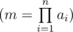
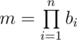

# A. On Number of Decompositions into Multipliers

**time limit per test:** 1 second

**memory limit per test:** 256 megabytes

**input:** stdin

**output:** stdout

You are given an integer *m* as a product of integers *a*~1~, *a*~2~, ... *a*~*n*~



. Your task is to find the number of distinct decompositions of number *m* into the product of *n* ordered positive integers.

Decomposition into *n* products, given in the input, must also be considered in the answer. As the answer can be very large, print it modulo 1000000007 (10^9^ + 7).

#### Input

The first line contains positive integer *n* (1 ≤ *n* ≤ 500). The second line contains space-separated integers *a*~1~, *a*~2~, ..., *a*~*n*~ (1 ≤ *a*~*i*~ ≤ 10^9^).

#### Output

In a single line print a single number *k* — the number of distinct decompositions of number *m* into *n* ordered multipliers modulo 1000000007 (10^9^ + 7).

#### Examples

#### Input
```
1
15
```

#### Output
```
1
```

#### Input
```
3
1 1 2
```

#### Output
```
3
```

#### Input
```
2
5 7
```

#### Output
```
4
```

#### Note

In the second sample, the get a decomposition of number 2, you need any one number out of three to equal 2, and the rest to equal 1.

In the third sample, the possible ways of decomposing into ordered multipliers are [7,5], [5,7], [1,35], [35,1].

A decomposition of positive integer *m* into *n* ordered multipliers is a cortege of positive integers *b* = {*b*~1~, *b*~2~, ... *b*~*n*~} such that



. Two decompositions *b* and *c* are considered different, if there exists index *i* such that *b*~*i*~ ≠ *c*~*i*~.
