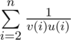

# B. On Sum of Fractions

**time limit per test:** 2 seconds

**memory limit per test:** 256 megabytes

**input:** stdin

**output:** stdout

Let's assume that

- *v*(*n*) is the largest prime number, that does not exceed *n*;
- *u*(*n*) is the smallest prime number strictly greater than *n*.

Find



.

#### Input

The first line contains integer *t* (1 ≤ *t* ≤ 500) — the number of testscases.

Each of the following *t* lines of the input contains integer *n* (2 ≤ *n* ≤ 10^9^).

#### Output

Print *t* lines: the *i*-th of them must contain the answer to the *i*-th test as an irreducible fraction "*p*/*q*", where *p*, *q* are integers, *q* > 0.

#### Examples

#### Input
```
2
2
3
```

#### Output
```
1/6
7/30
```
