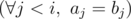

# D. On Sum of Number of Inversions in Permutations

**time limit per test:** 3 seconds

**memory limit per test:** 256 megabytes

**input:** stdin

**output:** stdout

You are given a permutation *p*. Calculate the total number of inversions in all permutations that lexicographically do not exceed the given one.

As this number can be very large, print it modulo 1000000007 (10^9^ + 7).

#### Input

The first line contains a single integer *n* (1 ≤ *n* ≤ 10^6^) — the length of the permutation. The second line contains *n* distinct integers *p*~1~, *p*~2~, ..., *p*~*n*~ (1 ≤ *p*~*i*~ ≤ *n*).

#### Output

Print a single number — the answer to the problem modulo 1000000007 (10^9^ + 7).

#### Examples

#### Input
```
2
2 1
```

#### Output
```
1
```

#### Input
```
3
2 1 3
```

#### Output
```
2
```

#### Note

Permutation *p* of length *n* is the sequence that consists of *n* distinct integers, each of them is from 1 to *n*.

An inversion of permutation *p*~1~, *p*~2~, ..., *p*~*n*~ is a pair of indexes (*i*, *j*), such that *i* < *j* and *p*~*i*~ > *p*~*j*~.

Permutation *a* do not exceed permutation *b* lexicographically, if either *a* = *b* or there exists such number *i*, for which the following logical condition fulfills:



 AND (*a*~*i*~ < *b*~*i*~).
