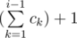
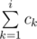
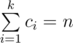

# D. Dima and Bacteria

**time limit per test:** 2 seconds

**memory limit per test:** 256 megabytes

**input:** stdin

**output:** stdout

Dima took up the biology of bacteria, as a result of his experiments, he invented *k* types of bacteria. Overall, there are *n* bacteria at his laboratory right now, and the number of bacteria of type *i* equals *c*~*i*~. For convenience, we will assume that all the bacteria are numbered from 1 to *n*. The bacteria of type *c*~*i*~ are numbered from



 to



.

With the help of special equipment Dima can move energy from some bacteria into some other one. Of course, the use of such equipment is not free. Dima knows *m* ways to move energy from some bacteria to another one. The way with number *i* can be described with integers *u*~*i*~, *v*~*i*~ and *x*~*i*~ mean that this way allows moving energy from bacteria with number *u*~*i*~ to bacteria with number *v*~*i*~ or vice versa for *x*~*i*~ dollars.

Dima's Chef (Inna) calls the type-distribution correct if there is a way (may be non-direct) to move energy from any bacteria of the particular type to any other bacteria of the same type (between any two bacteria of the same type) for zero cost.

As for correct type-distribution the cost of moving the energy depends only on the types of bacteria help Inna to determine is the type-distribution correct? If it is, print the matrix *d* with size *k* × *k*. Cell *d*[*i*][*j*] of this matrix must be equal to the minimal possible cost of energy-moving from bacteria with type *i* to bacteria with type *j*.

#### Input

The first line contains three integers *n*, *m*, *k* (1 ≤ *n* ≤ 10^5^; 0 ≤ *m* ≤ 10^5^; 1 ≤ *k* ≤ 500). The next line contains *k* integers *c*~1~, *c*~2~, ..., *c*~*k*~ (1 ≤ *c*~*i*~ ≤ *n*). Each of the next *m* lines contains three integers *u*~*i*~, *v*~*i*~, *x*~*i*~ (1 ≤ *u*~*i*~, *v*~*i*~ ≤ 10^5^; 0 ≤ *x*~*i*~ ≤ 10^4^). It is guaranteed that



.

#### Output

If Dima's type-distribution is correct, print string «Yes», and then *k* lines: in the *i*-th line print integers *d*[*i*][1], *d*[*i*][2], ..., *d*[*i*][*k*] (*d*[*i*][*i*] = 0). If there is no way to move energy from bacteria *i* to bacteria *j* appropriate *d*[*i*][*j*] must equal to -1. If the type-distribution isn't correct print «No».

#### Examples

#### Input
```
4 4 2
1 3
2 3 0
3 4 0
2 4 1
2 1 2
```

#### Output
```
Yes
0 2
2 0
```

#### Input
```
3 1 2
2 1
1 2 0
```

#### Output
```
Yes
0 -1
-1 0
```

#### Input
```
3 2 2
2 1
1 2 0
2 3 1
```

#### Output
```
Yes
0 1
1 0
```

#### Input
```
3 0 2
1 2
```

#### Output
```
No
```
