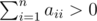

# E. Strictly Positive Matrix

**time limit per test:** 1 second

**memory limit per test:** 256 megabytes

**input:** stdin

**output:** stdout

You have matrix *a* of size *n* × *n*. Let's number the rows of the matrix from 1 to *n* from top to bottom, let's number the columns from 1 to *n* from left to right. Let's use *a*~*ij*~ to represent the element on the intersection of the *i*-th row and the *j*-th column.

Matrix *a* meets the following two conditions:

- for any numbers *i*, *j* (1 ≤ *i*, *j* ≤ *n*) the following inequality holds: *a*~*ij*~ ≥ 0;
-



.

Matrix *b* is strictly positive, if for any numbers *i*, *j* (1 ≤ *i*, *j* ≤ *n*) the inequality *b*~*ij*~ > 0 holds. You task is to determine if there is such integer *k* ≥ 1, that matrix *a*^*k*^ is strictly positive.

#### Input

The first line contains integer *n* (2 ≤ *n* ≤ 2000) — the number of rows and columns in matrix *a*.

The next *n* lines contain the description of the rows of matrix *a*. The *i*-th line contains *n* non-negative integers *a*~*i*1~, *a*~*i*2~, ..., *a*~*in*~ (0 ≤ *a*~*ij*~ ≤ 50). It is guaranteed that


.

#### Output

If there is a positive integer *k* ≥ 1, such that matrix *a*^*k*^ is strictly positive, print "YES" (without the quotes). Otherwise, print "NO" (without the quotes).

#### Examples

#### Input
```
2
1 0
0 1
```

#### Output
```
NO
```

#### Input
```
5
4 5 6 1 2
1 2 3 4 5
6 4 1 2 4
1 1 1 1 1
4 4 4 4 4
```

#### Output
```
YES
```
