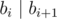

# B. Mashmokh and ACM

**time limit per test:** 1 second

**memory limit per test:** 256 megabytes

**input:** stdin

**output:** stdout

Mashmokh's boss, Bimokh, didn't like Mashmokh. So he fired him. Mashmokh decided to go to university and participate in ACM instead of finding a new job. He wants to become a member of Bamokh's team. In order to join he was given some programming tasks and one week to solve them. Mashmokh is not a very experienced programmer. Actually he is not a programmer at all. So he wasn't able to solve them. That's why he asked you to help him with these tasks. One of these tasks is the following.

A sequence of *l* integers *b*~1~, *b*~2~, ..., *b*~*l*~ (1 ≤ *b*~1~ ≤ *b*~2~ ≤ ... ≤ *b*~*l*~ ≤ *n*) is called good if each number divides (without a remainder) by the next number in the sequence. More formally



 for all *i* (1 ≤ *i* ≤ *l* - 1).

Given *n* and *k* find the number of good sequences of length *k*. As the answer can be rather large print it modulo 1000000007 (10^9^ + 7).

#### Input

The first line of input contains two space-separated integers *n*, *k* (1 ≤ *n*, *k* ≤ 2000).

#### Output

Output a single integer — the number of good sequences of length *k* modulo 1000000007 (10^9^ + 7).

#### Examples

#### Input
```
3 2
```

#### Output
```
5
```

#### Input
```
6 4
```

#### Output
```
39
```

#### Input
```
2 1
```

#### Output
```
2
```

#### Note

In the first sample the good sequences are: [1, 1], [2, 2], [3, 3], [1, 2], [1, 3].
