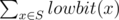

# B. The Child and Set

**time limit per test:** 1 second

**memory limit per test:** 256 megabytes

**input:** stdin

**output:** stdout

At the children's day, the child came to Picks's house, and messed his house up. Picks was angry at him. A lot of important things were lost, in particular the favorite set of Picks.

Fortunately, Picks remembers something about his set *S*:

- its elements were distinct integers from 1 to *limit*;
- the value of



 was equal to *sum*; here *lowbit*(*x*) equals 2^*k*^ where *k* is the position of the first one in the binary representation of *x*. For example, *lowbit*(10010~2~) = 10~2~, *lowbit*(10001~2~) = 1~2~, *lowbit*(10000~2~) = 10000~2~ (binary representation).

Can you help Picks and find any set *S*, that satisfies all the above conditions?

#### Input

The first line contains two integers: *sum*, *limit* (1 ≤ *sum*, *limit* ≤ 10^5^).

#### Output

In the first line print an integer *n* (1 ≤ *n* ≤ 10^5^), denoting the size of *S*. Then print the elements of set *S* in any order. If there are multiple answers, print any of them.

If it's impossible to find a suitable set, print -1.

#### Examples

#### Input
```
5 5
```

#### Output
```
2
4 5
```

#### Input
```
4 3
```

#### Output
```
3
2 3 1
```

#### Input
```
5 1
```

#### Output
```
-1
```

#### Note

In sample test 1: *lowbit*(4) = 4, *lowbit*(5) = 1, 4 + 1 = 5.

In sample test 2: *lowbit*(1) = 1, *lowbit*(2) = 2, *lowbit*(3) = 1, 1 + 2 + 1 = 4.
