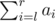

# C. DZY Loves Fibonacci Numbers

**time limit per test:** 4 seconds

**memory limit per test:** 256 megabytes

**input:** stdin

**output:** stdout

In mathematical terms, the sequence *F*~*n*~ of Fibonacci numbers is defined by the recurrence relation
*F*~1~ = 1; *F*~2~ = 1; *F*~*n*~ = *F*~*n* - 1~ + *F*~*n* - 2~ (*n* > 2).
DZY loves Fibonacci numbers very much. Today DZY gives you an array consisting of *n* integers: *a*~1~, *a*~2~, ..., *a*~*n*~. Moreover, there are *m* queries, each query has one of the two types:

- Format of the query "1 *l* *r*". In reply to the query, you need to add *F*~*i* - *l* + 1~ to each element *a*~*i*~, where *l* ≤ *i* ≤ *r*.
- Format of the query "2 *l* *r*". In reply to the query you should output the value of



 modulo 1000000009 (10^9^ + 9).

Help DZY reply to all the queries.

#### Input

The first line of the input contains two integers *n* and *m* (1 ≤ *n*, *m* ≤ 300000). The second line contains *n* integers *a*~1~, *a*~2~, ..., *a*~*n*~ (1 ≤ *a*~*i*~ ≤ 10^9^) — initial array *a*.

Then, *m* lines follow. A single line describes a single query in the format given in the statement. It is guaranteed that for each query inequality 1 ≤ *l* ≤ *r* ≤ *n* holds.

#### Output

For each query of the second type, print the value of the sum on a single line.

#### Examples

#### Input
```
4 4
1 2 3 4
1 1 4
2 1 4
1 2 4
2 1 3
```

#### Output
```
17
12
```

#### Note

After the first query, *a* = [2, 3, 5, 7].

For the second query, *sum* = 2 + 3 + 5 + 7 = 17.

After the third query, *a* = [2, 4, 6, 9].

For the fourth query, *sum* = 2 + 4 + 6 = 12.
