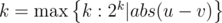

# E. DZY Loves Bridges

**time limit per test:** 5 seconds

**memory limit per test:** 512 megabytes

**input:** stdin

**output:** stdout

DZY owns 2^*m*^ islands near his home, numbered from 1 to 2^*m*^. He loves building bridges to connect the islands. Every bridge he builds takes one day's time to walk across.

DZY has a strange rule of building the bridges. For every pair of islands *u*, *v* (*u* ≠ *v*), he has built 2^*k*^ different bridges connecting them, where



 (*a*|*b* means *b* is divisible by *a*). These bridges are bidirectional.

Also, DZY has built some bridges connecting his home with the islands. Specifically, there are *a*~*i*~ different bridges from his home to the *i*-th island. These are one-way bridges, so after he leaves his home he will never come back.

DZY decides to go to the islands for sightseeing. At first he is at home. He chooses and walks across one of the bridges connecting with his home, and arrives at some island. After that, he will spend *t* day(s) on the islands. Each day, he can choose to stay and rest, or to walk to another island across the bridge. It is allowed to stay at an island for more than one day. It's also allowed to cross one bridge more than once.

Suppose that right after the *t*-th day DZY stands at the *i*-th island. Let *ans*[*i*] be the number of ways for DZY to reach the *i*-th island after *t*-th day. Your task is to calculate *ans*[*i*] for each *i* modulo 1051131.

#### Input

To avoid huge input, we use the following way to generate the array *a*. You are given the first *s* elements of array: *a*~1~, *a*~2~, ..., *a*~*s*~. All the other elements should be calculated by formula: *a*~*i*~ = (101·*a*~*i* - *s*~ + 10007) *mod* 1051131 (*s* < *i* ≤ 2^*m*^).

The first line contains three integers *m*, *t*, *s* (1 ≤ *m* ≤ 25; 1 ≤ *t* ≤ 10^18^; 1 ≤ *s* ≤ *min*(2^*m*^, 10^5^)).

The second line contains *s* integers *a*~1~, *a*~2~, ..., *a*~*s*~ (1 ≤ *a*~*i*~ ≤ 10^6^).

#### Output

To avoid huge output, you only need to output xor-sum of all the answers for all *i* modulo 1051131 (1 ≤ *i* ≤ 2^*m*^), i.e. (*ans*[1] *mod* 1051131) *xor* (*ans*[2] *mod* 1051131) *xor*... *xor* (*ans*[*n*] *mod* 1051131).

#### Examples

#### Input
```
2 1 4
1 1 1 2
```

#### Output
```
1
```

#### Input
```
3 5 6
389094 705719 547193 653800 947499 17024
```

#### Output
```
556970
```

#### Note

In the first sample, *ans* = [6, 7, 6, 6].

If he wants to be at island 1 after one day, he has 6 different ways:

- home —> 1 -(stay)-> 1
- home —> 2 —> 1
- home —> 3 —> 1
- home —> 3 —> 1 (note that there are two different bridges between 1 and 3)
- home —> 4 —> 1
- home —> 4 —> 1 (note that there are two different bridges from home to 4)

In the second sample, (*a*~1~, *a*~2~, *a*~3~, *a*~4~, *a*~5~, *a*~6~, *a*~7~, *a*~8~) = (389094, 705719, 547193, 653800, 947499, 17024, 416654, 861849), *ans* = [235771, 712729, 433182, 745954, 139255, 935785, 620229, 644335].
