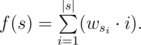

# B. DZY Loves Strings

**time limit per test:** 1 second

**memory limit per test:** 256 megabytes

**input:** stdin

**output:** stdout

DZY loves collecting special strings which only contain lowercase letters. For each lowercase letter *c* DZY knows its value *w*~*c*~. For each special string *s* = *s*~1~*s*~2~... *s*~|*s*|~ (|*s*| is the length of the string) he represents its value with a function *f*(*s*), where



Now DZY has a string *s*. He wants to insert *k* lowercase letters into this string in order to get the largest possible value of the resulting string. Can you help him calculate the largest possible value he could get?

#### Input

The first line contains a single string *s* (1 ≤ |*s*| ≤ 10^3^).

The second line contains a single integer *k* (0 ≤ *k* ≤ 10^3^).

The third line contains twenty-six integers from *w*~*a*~ to *w*~*z*~. Each such number is non-negative and doesn't exceed 1000.

#### Output

Print a single integer — the largest possible value of the resulting string DZY could get.

#### Examples

#### Input
```
abc
3
1 2 2 1 1 1 1 1 1 1 1 1 1 1 1 1 1 1 1 1 1 1 1 1 1 1
```

#### Output
```
41
```

#### Note

In the test sample DZY can obtain "abcbbc", *value* = 1·1 + 2·2 + 3·2 + 4·2 + 5·2 + 6·2 = 41.
