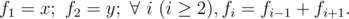

# B. Jzzhu and Sequences

**time limit per test:** 1 second

**memory limit per test:** 256 megabytes

**input:** stdin

**output:** stdout

Jzzhu has invented a kind of sequences, they meet the following property:



You are given *x* and *y*, please calculate *f*~*n*~ modulo 1000000007 (10^9^ + 7).

#### Input

The first line contains two integers *x* and *y* (|*x*|, |*y*| ≤ 10^9^). The second line contains a single integer *n* (1 ≤ *n* ≤ 2·10^9^).

#### Output

Output a single integer representing *f*~*n*~ modulo 1000000007 (10^9^ + 7).

#### Examples

#### Input
```
2 3
3
```

#### Output
```
1
```

#### Input
```
0 -1
2
```

#### Output
```
1000000006
```

#### Note

In the first sample, *f*~2~ = *f*~1~ + *f*~3~, 3 = 2 + *f*~3~, *f*~3~ = 1.

In the second sample, *f*~2~ =  - 1;  - 1 modulo (10^9^ + 7) equals (10^9^ + 6).
