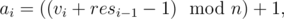

# B. School

**time limit per test:** 2 seconds

**memory limit per test:** 256 megabytes

**input:** stdin

**output:** stdout

There are *n* students studying in the 6th grade, in group "B" of a berland secondary school. Every one of them has exactly one friend whom he calls when he has some news. Let us denote the friend of the person number *i* by *g*(*i*). Note that the friendships are not mutual, i.e. *g*(*g*(*i*)) is not necessarily equal to *i*.

On day *i* the person numbered as *a*~*i*~ learns the news with the rating of *b*~*i*~ (*b*~*i*~ ≥ 1). He phones the friend immediately and tells it. While he is doing it, the news becomes old and its rating falls a little and becomes equal to *b*~*i*~ - 1. The friend does the same thing — he also calls his friend and also tells the news. The friend of the friend gets the news already rated as *b*~*i*~ - 2. It all continues until the rating of the news reaches zero as nobody wants to tell the news with zero rating.

More formally, everybody acts like this: if a person *x* learns the news with a non-zero rating *y*, he calls his friend *g*(*i*) and his friend learns the news with the rating of *y* - 1 and, if it is possible, continues the process.

Let us note that during a day one and the same person may call his friend and tell him one and the same news with different ratings. Thus, the news with the rating of *b*~*i*~ will lead to as much as *b*~*i*~ calls.

Your task is to count the values of *res*~*i*~ — how many students learned their first news on day *i*.

The values of *b*~*i*~ are known initially, whereas *a*~*i*~ is determined from the following formula:



 where mod stands for the operation of taking the excess from the cleavage, *res*~0~ is considered equal to zero and *v*~*i*~ — some given integers.

#### Input

The first line contains two space-separated integers *n* and *m* (2 ≤ *n*, *m* ≤ 10^5^) — the number of students and the number of days. The second line contains *n* space-separated integers *g*(*i*) (1 ≤ *g*(*i*) ≤ *n*, *g*(*i*) ≠ *i*) — the number of a friend of the *i*-th student. The third line contains *m* space-separated integers *v*~*i*~ (1 ≤ *v*~*i*~ ≤ 10^7^). The fourth line contains *m* space-separated integers *b*~*i*~ (1 ≤ *b*~*i*~ ≤ 10^7^).

#### Output

Print *m* lines containing one number each. The *i*-th line should contain *res*~*i*~ — for what number of students the first news they've learned over the *m* days in question, was the news number *i*. The number of the news is the number of the day on which it can be learned. The days are numbered starting from one in the order in which they are given in the input file. Don't output *res*~0~.

#### Examples

#### Input
```
3 4
2 3 1
1 2 3 4
1 2 3 4
```

#### Output
```
1
1
1
0
```

#### Input
```
8 6
7 6 4 2 3 5 5 7
10 4 3 8 9 1
1 1 1 2 2 2
```

#### Output
```
1
1
1
2
1
1
```
