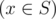
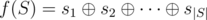

# D. Little Victor and Set

**time limit per test:** 1 second

**memory limit per test:** 256 megabytes

**input:** stdin

**output:** stdout

Little Victor adores the sets theory. Let us remind you that a set is a group of numbers where all numbers are pairwise distinct. Today Victor wants to find a set of integers *S* that has the following properties:

- for all *x*



 the following inequality holds *l* ≤ *x* ≤ *r*;
- 1 ≤ |*S*| ≤ *k*;
- lets denote the *i*-th element of the set *S* as *s*~*i*~; value



 must be as small as possible.

Help Victor find the described set.

#### Input

The first line contains three space-separated integers *l*, *r*, *k* (1 ≤ *l* ≤ *r* ≤ 10^12^; 1 ≤ *k* ≤ *min*(10^6^, *r* - *l* + 1)).

#### Output

Print the minimum possible value of *f*(*S*). Then print the cardinality of set |*S*|. Then print the elements of the set in any order.

If there are multiple optimal sets, you can print any of them.

#### Examples

#### Input
```
8 15 3
```

#### Output
```
1
2
10 11
```

#### Input
```
8 30 7
```

#### Output
```
0
5
14 9 28 11 16
```

#### Note

Operation


 represents the operation of bitwise exclusive OR. In other words, it is the XOR operation.
