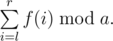
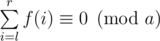

# C. Hack it!

**time limit per test:** 1 second

**memory limit per test:** 256 megabytes

**input:** stdin

**output:** stdout

Little X has met the following problem recently.

Let's define *f*(*x*) as the sum of digits in decimal representation of number *x* (for example, *f*(1234) = 1 + 2 + 3 + 4). You are to calculate



Of course Little X has solved this problem quickly, has locked it, and then has tried to hack others. He has seen the following C++ code:
```
    ans = solve(l, r) % a;
    if (ans <= 0)
      ans += a;
```
 This code will fail only on the test with



. You are given number *a*, help Little X to find a proper test for hack.

#### Input

The first line contains a single integer *a* (1 ≤ *a* ≤ 10^18^).

#### Output

Print two integers: *l*, *r* (1 ≤ *l* ≤ *r* < 10^200^) — the required test data. Leading zeros aren't allowed. It's guaranteed that the solution exists.

#### Examples

#### Input
```
46
```

#### Output
```
1 10
```

#### Input
```
126444381000032
```

#### Output
```
2333333 2333333333333
```
