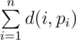

# D. Tree

**time limit per test:** 2 seconds

**memory limit per test:** 256 megabytes

**input:** stdin

**output:** stdout

Little X has a tree consisting of *n* nodes (they are numbered from 1 to *n*). Each edge of the tree has a positive length. Let's define the distance between two nodes *v* and *u* (we'll denote it *d*(*v*, *u*)) as the sum of the lengths of edges in the shortest path between *v* and *u*.

A permutation *p* is a sequence of *n* distinct integers *p*~1~, *p*~2~, ..., *p*~*n*~ (1 ≤ *p*~*i*~ ≤ *n*). Little X wants to find a permutation *p* such that sum



 is maximal possible. If there are multiple optimal permutations, he wants to find the lexicographically smallest one. Help him with the task!

#### Input

The first line contains an integer *n* (1 ≤ *n* ≤ 10^5^).

Each of the next *n* - 1 lines contains three space separated integers *u*~*i*~,  *v*~*i*~, *w*~*i*~ (1 ≤  *u*~*i*~,  *v*~*i*~ ≤  *n*; 1 ≤  *w*~*i*~ ≤  10^5^), denoting an edge between nodes *u*~*i*~ and *v*~*i*~ with length equal to *w*~*i*~.

It is guaranteed that these edges form a tree.

#### Output

In the first line print the maximum possible value of the described sum. In the second line print *n* integers, representing the lexicographically smallest permutation.

#### Examples

#### Input
```
2
1 2 3
```

#### Output
```
6
2 1
```

#### Input
```
5
1 2 2
1 3 3
2 4 4
2 5 5
```

#### Output
```
32
2 1 4 5 3
```
