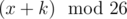

# D. Caesar Cipher

**time limit per test:** 2 seconds

**memory limit per test:** 256 megabytes

**input:** stdin

**output:** stdout

Caesar cipher is one of the simplest encryption techniques. To transform the original message into encrypted one using key *k*, one has to replace each letter with a letter which is *k* positions later in the alphabet (if this takes the position beyond Z, the rest of it is counted from the start of the alphabet). In a more formal way, if letters of the alphabet are enumerated starting with 0, the result of encryption for character *x* will be



 (26 is the number of letters in the Latin alphabet).

You are given the original message and the encryption key *k*. Output the result of encryption.

#### Input

The first line of input contains an integer *k* (0 ≤ *k* ≤ 25) — the encryption key.

The second line contains the original message — a sequence of uppercase Latin letters ('A'-'Z'). The length of the message is from 1 to 10, inclusive.

#### Output

Output the result of encryption.

#### Examples

#### Input
```
5
CODEFORCES
```

#### Output
```
HTIJKTWHJX
```

#### Input
```
13
FALSERULEZ
```

#### Output
```
SNYFREHYRM
```
