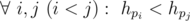

# C. Design Tutorial: Make It Nondeterministic

**time limit per test:** 2 seconds

**memory limit per test:** 256 megabytes

**input:** stdin

**output:** stdout

A way to make a new task is to make it nondeterministic or probabilistic. For example, the hard task of Topcoder SRM 595, Constellation, is the probabilistic version of a convex hull.

Let's try to make a new task. Firstly we will use the following task. There are *n* people, sort them by their name. It is just an ordinary sorting problem, but we can make it more interesting by adding nondeterministic element. There are *n* people, each person will use either his/her first name or last name as a handle. Can the lexicographical order of the handles be exactly equal to the given permutation *p*?

More formally, if we denote the handle of the *i*-th person as *h*~*i*~, then the following condition must hold:



.

#### Input

The first line contains an integer *n* (1 ≤ *n* ≤ 10^5^) — the number of people.

The next *n* lines each contains two strings. The *i*-th line contains strings *f*~*i*~ and *s*~*i*~ (1 ≤ |*f*~*i*~|, |*s*~*i*~| ≤ 50) — the first name and last name of the *i*-th person. Each string consists only of lowercase English letters. All of the given 2*n* strings will be distinct.

The next line contains *n* distinct integers: *p*~1~, *p*~2~, ..., *p*~*n*~ (1 ≤ *p*~*i*~ ≤ *n*).

#### Output

If it is possible, output "YES", otherwise output "NO".

#### Examples

#### Input
```
3
gennady korotkevich
petr mitrichev
gaoyuan chen
1 2 3
```

#### Output
```
NO
```

#### Input
```
3
gennady korotkevich
petr mitrichev
gaoyuan chen
3 1 2
```

#### Output
```
YES
```

#### Input
```
2
galileo galilei
nicolaus copernicus
2 1
```

#### Output
```
YES
```

#### Input
```
10
rean schwarzer
fei claussell
alisa reinford
eliot craig
laura arseid
jusis albarea
machias regnitz
sara valestin
emma millstein
gaius worzel
1 2 3 4 5 6 7 8 9 10
```

#### Output
```
NO
```

#### Input
```
10
rean schwarzer
fei claussell
alisa reinford
eliot craig
laura arseid
jusis albarea
machias regnitz
sara valestin
emma millstein
gaius worzel
2 4 9 6 5 7 1 3 8 10
```

#### Output
```
YES
```

#### Note

In example 1 and 2, we have 3 people: tourist, Petr and me (cgy4ever). You can see that whatever handle is chosen, I must be the first, then tourist and Petr must be the last.

In example 3, if Copernicus uses "copernicus" as his handle, everything will be alright.
