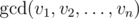

# D. CGCDSSQ

**time limit per test:** 2 seconds

**memory limit per test:** 256 megabytes

**input:** stdin

**output:** stdout

Given a sequence of integers *a*~1~, ..., *a*~*n*~ and *q* queries *x*~1~, ..., *x*~*q*~ on it. For each query *x*~*i*~ you have to count the number of pairs (*l*, *r*) such that 1 ≤ *l* ≤ *r* ≤ *n* and *gcd*(*a*~*l*~, *a*~*l* + 1~, ..., *a*~*r*~) = *x*~*i*~.



 is a greatest common divisor of *v*~1~, *v*~2~, ..., *v*~*n*~, that is equal to a largest positive integer that divides all *v*~*i*~.

#### Input

The first line of the input contains integer *n*, (1 ≤ *n* ≤ 10^5^), denoting the length of the sequence. The next line contains *n* space separated integers *a*~1~, ..., *a*~*n*~, (1 ≤ *a*~*i*~ ≤ 10^9^).

The third line of the input contains integer *q*, (1 ≤ *q* ≤ 3 × 10^5^), denoting the number of queries. Then follows *q* lines, each contain an integer *x*~*i*~, (1 ≤ *x*~*i*~ ≤ 10^9^).

#### Output

For each query print the result in a separate line.

#### Examples

#### Input
```
3
2 6 3
5
1
2
3
4
6
```

#### Output
```
1
2
2
0
1
```

#### Input
```
7
10 20 3 15 1000 60 16
10
1
2
3
4
5
6
10
20
60
1000
```

#### Output
```
14
0
2
2
2
0
2
2
1
1
```
