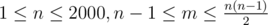

# E. Strongly Connected City 2

**time limit per test:** 2 seconds

**memory limit per test:** 256 megabytes

**input:** stdin

**output:** stdout

Imagine a city with *n* junctions and *m* streets. Junctions are numbered from 1 to *n*.

In order to increase the traffic flow, mayor of the city has decided to make each street one-way. This means in the street between junctions *u* and *v*, the traffic moves only from *u* to *v* or only from *v* to *u*.

The problem is to direct the traffic flow of streets in a way that maximizes the number of pairs (*u*, *v*) where 1 ≤ *u*, *v* ≤ *n* and it is possible to reach junction *v* from *u* by passing the streets in their specified direction. Your task is to find out maximal possible number of such pairs.

#### Input

The first line of input contains integers *n* and *m*, (



), denoting the number of junctions and streets of the city.

Each of the following *m* lines contains two integers *u* and *v*, (*u* ≠ *v*), denoting endpoints of a street in the city.

Between every two junctions there will be at most one street. It is guaranteed that before mayor decision (when all streets were two-way) it was possible to reach each junction from any other junction.

#### Output

Print the maximal number of pairs (*u*, *v*) such that that it is possible to reach junction *v* from *u* after directing the streets.

#### Examples

#### Input
```
5 4
1 2
1 3
1 4
1 5
```

#### Output
```
13
```

#### Input
```
4 5
1 2
2 3
3 4
4 1
1 3
```

#### Output
```
16
```

#### Input
```
2 1
1 2
```

#### Output
```
3
```

#### Input
```
6 7
1 2
2 3
1 3
1 4
4 5
5 6
6 4
```

#### Output
```
27
```

#### Note

In the first sample, if the mayor makes first and second streets one-way towards the junction 1 and third and fourth streets in opposite direction, there would be 13 pairs of reachable junctions: {(1, 1), (2, 2), (3, 3), (4, 4), (5, 5), (2, 1), (3, 1), (1, 4), (1, 5), (2, 4), (2, 5), (3, 4), (3, 5)}
