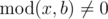
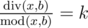
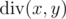
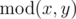
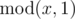

# C. Dreamoon and Sums

**time limit per test:** 1.5 seconds

**memory limit per test:** 256 megabytes

**input:** stdin

**output:** stdout

Dreamoon loves summing up something for no reason. One day he obtains two integers *a* and *b* occasionally. He wants to calculate the sum of all nice integers. Positive integer *x* is called nice if



 and



, where *k* is some integer number in range [1, *a*].

By



 we denote the quotient of integer division of *x* and *y*. By



 we denote the remainder of integer division of *x* and *y*. You can read more about these operations here: http://goo.gl/AcsXhT.

The answer may be large, so please print its remainder modulo 1 000 000 007 (10^9^ + 7). Can you compute it faster than Dreamoon?

#### Input

The single line of the input contains two integers *a*, *b* (1 ≤ *a*, *b* ≤ 10^7^).

#### Output

Print a single integer representing the answer modulo 1 000 000 007 (10^9^ + 7).

#### Examples

#### Input
```
1 1
```

#### Output
```
0
```

#### Input
```
2 2
```

#### Output
```
8
```

#### Note

For the first sample, there are no nice integers because



 is always zero.

For the second sample, the set of nice integers is {3, 5}.
