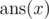
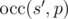

# E. Dreamoon and Strings

**time limit per test:** 1 second

**memory limit per test:** 256 megabytes

**input:** stdin

**output:** stdout

Dreamoon has a string *s* and a pattern string *p*. He first removes exactly *x* characters from *s* obtaining string *s*' as a result. Then he calculates


 that is defined as the maximal number of non-overlapping substrings equal to *p* that can be found in *s*'. He wants to make this number as big as possible.

More formally, let's define



 as maximum value of



 over all *s*' that can be obtained by removing exactly *x* characters from *s*. Dreamoon wants to know


 for all *x* from 0 to |*s*| where |*s*| denotes the length of string *s*.

#### Input

The first line of the input contains the string *s* (1 ≤ |*s*| ≤ 2 000).

The second line of the input contains the string *p* (1 ≤ |*p*| ≤ 500).

Both strings will only consist of lower case English letters.

#### Output

Print |*s*| + 1 space-separated integers in a single line representing the


 for all *x* from 0 to |*s*|.

#### Examples

#### Input
```
aaaaa
aa
```

#### Output
```
2 2 1 1 0 0
```

#### Input
```
axbaxxb
ab
```

#### Output
```
0 1 1 2 1 1 0 0
```

#### Note

For the first sample, the corresponding optimal values of *s*' after removal 0 through |*s*| = 5 characters from *s* are {"aaaaa", "aaaa", "aaa", "aa", "a", ""}.

For the second sample, possible corresponding optimal values of *s*' are {"axbaxxb", "abaxxb", "axbab", "abab", "aba", "ab", "a", ""}.
