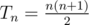

# A. Triangular numbers

**time limit per test:** 2 seconds

**memory limit per test:** 256 megabytes

**input:** stdin

**output:** stdout

A triangular number is the number of dots in an equilateral triangle uniformly filled with dots. For example, three dots can be arranged in a triangle; thus three is a triangular number. The *n*-th triangular number is the number of dots in a triangle with *n* dots on a side.



. You can learn more about these numbers from Wikipedia (http://en.wikipedia.org/wiki/Triangular_number).

Your task is to find out if a given integer is a triangular number.

#### Input

The first line contains the single number *n* (1 ≤ *n* ≤ 500) — the given integer.

#### Output

If the given integer is a triangular number output YES, otherwise output NO.

#### Examples

#### Input
```
1
```

#### Output
```
YES
```

#### Input
```
2
```

#### Output
```
NO
```

#### Input
```
3
```

#### Output
```
YES
```
