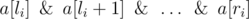

# B. Interesting Array

**time limit per test:** 1 second

**memory limit per test:** 256 megabytes

**input:** stdin

**output:** stdout

We'll call an array of *n* non-negative integers *a*[1], *a*[2], ..., *a*[*n*] interesting, if it meets *m* constraints. The *i*-th of the *m* constraints consists of three integers *l*~*i*~, *r*~*i*~, *q*~*i*~ (1 ≤ *l*~*i*~ ≤ *r*~*i*~ ≤ *n*) meaning that value



 should be equal to *q*~*i*~.

Your task is to find any interesting array of *n* elements or state that such array doesn't exist.

Expression *x*&*y* means the bitwise AND of numbers *x* and *y*. In programming languages C++, Java and Python this operation is represented as "&", in Pascal — as "and".

#### Input

The first line contains two integers *n*, *m* (1 ≤ *n* ≤ 10^5^, 1 ≤ *m* ≤ 10^5^) — the number of elements in the array and the number of limits.

Each of the next *m* lines contains three integers *l*~*i*~, *r*~*i*~, *q*~*i*~ (1 ≤ *l*~*i*~ ≤ *r*~*i*~ ≤ *n*, 0 ≤ *q*~*i*~ < 2^30^) describing the *i*-th limit.

#### Output

If the interesting array exists, in the first line print "YES" (without the quotes) and in the second line print *n* integers *a*[1], *a*[2], ..., *a*[*n*] (0 ≤ *a*[*i*] < 2^30^) decribing the interesting array. If there are multiple answers, print any of them.

If the interesting array doesn't exist, print "NO" (without the quotes) in the single line.

#### Examples

#### Input
```
3 1
1 3 3
```

#### Output
```
YES
3 3 3
```

#### Input
```
3 2
1 3 3
1 3 2
```

#### Output
```
NO
```
