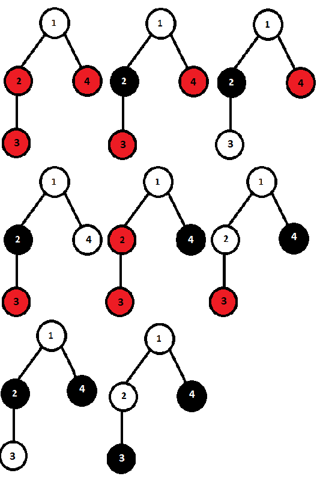

# D. Random Function and Tree

**time limit per test:** 1 second

**memory limit per test:** 256 megabytes

**input:** stdin

**output:** stdout

You have a rooted tree consisting of *n* vertices. Let's number them with integers from 1 to *n* inclusive. The root of the tree is the vertex 1. For each *i* > 1 direct parent of the vertex *i* is *p*~*i*~. We say that vertex *i* is child for its direct parent *p*~*i*~.

You have initially painted all the vertices with red color. You like to repaint some vertices of the tree. To perform painting you use the function paint that you call with the root of the tree as an argument. Here is the pseudocode of this function:
```cpp
count = 0 // global integer variable

rnd() { // this function is used in paint code
 return 0 or 1 equiprobably
}

paint(s) {
 if (count is even) then paint s with white color
 else paint s with black color

 count = count + 1

 if rnd() = 1 then children = [array of vertex s children in ascending order of their numbers]
 else children = [array of vertex s children in descending order of their numbers]

 for child in children { // iterating over children array
 if rnd() = 1 then paint(child) // calling paint recursively
 }
}
```

As a result of this function, some vertices may change their colors to white or black and some of them may remain red.

Your task is to determine the number of distinct possible colorings of the vertices of the tree. We will assume that the coloring is possible if there is a nonzero probability to get this coloring with a single call of *paint*(1). We assume that the colorings are different if there is a pair of vertices that are painted with different colors in these colorings. Since the required number may be very large, find its remainder of division by 1000000007 (10^9^ + 7).

#### Input

The first line contains a single integer *n* (2 ≤ *n* ≤ 10^5^) — the number of vertexes in the tree.

The second line contains *n* - 1 integers *p*~2~, *p*~3~, ..., *p*~*n*~ (1 ≤ *p*~*i*~ < *i*). Number *p*~*i*~ is the parent of vertex *i*.

#### Output

Print a single integer — the answer to the problem modulo 1000000007 (10^9^ + 7)

#### Examples

#### Input
```
4
1 2 1
```

#### Output
```
8
```

#### Input
```
3
1 1
```

#### Output
```
5
```

#### Note

All possible coloring patterns of the first sample are given below.
 


