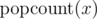

# A. Bits

**time limit per test:** 1 second

**memory limit per test:** 256 megabytes

**input:** stdin

**output:** stdout

Let's denote as


 the number of bits set ('1' bits) in the binary representation of the non-negative integer *x*.

You are given multiple queries consisting of pairs of integers *l* and *r*. For each query, find the *x*, such that *l* ≤ *x* ≤ *r*, and



 is maximum possible. If there are multiple such numbers find the smallest of them.

#### Input

The first line contains integer *n* — the number of queries (1 ≤ *n* ≤ 10000).

Each of the following *n* lines contain two integers *l*~*i*~, *r*~*i*~ — the arguments for the corresponding query (0 ≤ *l*~*i*~ ≤ *r*~*i*~ ≤ 10^18^).

#### Output

For each query print the answer in a separate line.

#### Examples

#### Input
```
3
1 2
2 4
1 10
```

#### Output
```
1
3
7
```

#### Note

The binary representations of numbers from 1 to 10 are listed below:

1~10~ = 1~2~

2~10~ = 10~2~

3~10~ = 11~2~

4~10~ = 100~2~

5~10~ = 101~2~

6~10~ = 110~2~

7~10~ = 111~2~

8~10~ = 1000~2~

9~10~ = 1001~2~

10~10~ = 1010~2~
