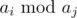

# B. Maximum Value

**time limit per test:** 1 second

**memory limit per test:** 256 megabytes

**input:** stdin

**output:** stdout

You are given a sequence *a* consisting of *n* integers. Find the maximum possible value of



 (integer remainder of *a*~*i*~ divided by *a*~*j*~), where 1 ≤ *i*, *j* ≤ *n* and *a*~*i*~ ≥ *a*~*j*~.

#### Input

The first line contains integer *n* — the length of the sequence (1 ≤ *n* ≤ 2·10^5^).

The second line contains *n* space-separated integers *a*~*i*~ (1 ≤ *a*~*i*~ ≤ 10^6^).

#### Output

Print the answer to the problem.

#### Examples

#### Input
```
3
3 4 5
```

#### Output
```
2
```
