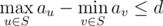

# D. Valid Sets

**time limit per test:** 1 second

**memory limit per test:** 256 megabytes

**input:** stdin

**output:** stdout

As you know, an undirected connected graph with *n* nodes and *n* - 1 edges is called a tree. You are given an integer *d* and a tree consisting of *n* nodes. Each node *i* has a value *a*~*i*~ associated with it.

We call a set *S* of tree nodes valid if following conditions are satisfied:
- *S* is non-empty.
- *S* is connected. In other words, if nodes *u* and *v* are in *S*, then all nodes lying on the simple path between *u* and *v* should also be presented in *S*.
-



.

Your task is to count the number of valid sets. Since the result can be very large, you must print its remainder modulo 1000000007 (10^9^ + 7).

#### Input

The first line contains two space-separated integers *d* (0 ≤ *d* ≤ 2000) and *n* (1 ≤ *n* ≤ 2000).

The second line contains *n* space-separated positive integers *a*~1~, *a*~2~, ..., *a*~*n*~(1 ≤ *a*~*i*~ ≤ 2000).

Then the next *n* - 1 line each contain pair of integers *u* and *v* (1 ≤ *u*, *v* ≤ *n*) denoting that there is an edge between *u* and *v*. It is guaranteed that these edges form a tree.

#### Output

Print the number of valid sets modulo 1000000007.

#### Examples

#### Input
```
1 4
2 1 3 2
1 2
1 3
3 4
```

#### Output
```
8
```

#### Input
```
0 3
1 2 3
1 2
2 3
```

#### Output
```
3
```

#### Input
```
4 8
7 8 7 5 4 6 4 10
1 6
1 2
5 8
1 3
3 5
6 7
3 4
```

#### Output
```
41
```

#### Note

In the first sample, there are exactly 8 valid sets: {1}, {2}, {3}, {4}, {1, 2}, {1, 3}, {3, 4} and {1, 3, 4}. Set {1, 2, 3, 4} is not valid, because the third condition isn't satisfied. Set {1, 4} satisfies the third condition, but conflicts with the second condition.
