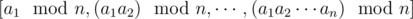

# C. Prefix Product Sequence

**time limit per test:** 1 second

**memory limit per test:** 256 megabytes

**input:** stdin

**output:** stdout

Consider a sequence [*a*~1~, *a*~2~, ... , *a*~*n*~]. Define its prefix product sequence



.

Now given *n*, find a permutation of [1, 2, ..., *n*], such that its prefix product sequence is a permutation of [0, 1, ..., *n* - 1].

#### Input

The only input line contains an integer *n* (1 ≤ *n* ≤ 10^5^).

#### Output

In the first output line, print "YES" if such sequence exists, or print "NO" if no such sequence exists.

If any solution exists, you should output *n* more lines. *i*-th line contains only an integer *a*~*i*~. The elements of the sequence should be different positive integers no larger than *n*.

If there are multiple solutions, you are allowed to print any of them.

#### Examples

#### Input
```
7
```

#### Output
```
YES
1
4
3
6
5
2
7
```

#### Input
```
6
```

#### Output
```
NO
```

#### Note

For the second sample, there are no valid sequences.
