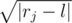
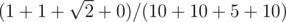

# E. Hiking

**time limit per test:** 1 second

**memory limit per test:** 256 megabytes

**input:** stdin

**output:** stdout

A traveler is planning a water hike along the river. He noted the suitable rest points for the night and wrote out their distances from the starting point. Each of these locations is further characterized by its picturesqueness, so for the *i*-th rest point the distance from the start equals *x*~*i*~, and its picturesqueness equals *b*~*i*~. The traveler will move down the river in one direction, we can assume that he will start from point 0 on the coordinate axis and rest points are points with coordinates *x*~*i*~.

Every day the traveler wants to cover the distance *l*. In practice, it turns out that this is not always possible, because he needs to end each day at one of the resting points. In addition, the traveler is choosing between two desires: cover distance *l* every day and visit the most picturesque places.

Let's assume that if the traveler covers distance *r*~*j*~ in a day, then he feels frustration



, and his total frustration over the hike is calculated as the total frustration on all days.

Help him plan the route so as to minimize the relative total frustration: the total frustration divided by the total picturesqueness of all the rest points he used.

The traveler's path must end in the farthest rest point.

#### Input

The first line of the input contains integers *n*, *l* (1 ≤ *n* ≤ 1000, 1 ≤ *l* ≤ 10^5^) — the number of rest points and the optimal length of one day path.

Then *n* lines follow, each line describes one rest point as a pair of integers *x*~*i*~, *b*~*i*~ (1 ≤ *x*~*i*~, *b*~*i*~ ≤ 10^6^). No two rest points have the same *x*~*i*~, the lines are given in the order of strictly increasing *x*~*i*~.

#### Output

Print the traveler's path as a sequence of the numbers of the resting points he used in the order he used them. Number the points from 1 to *n* in the order of increasing *x*~*i*~. The last printed number must be equal to *n*.

#### Examples

#### Input
```
5 9
10 10
20 10
30 1
31 5
40 10
```

#### Output
```
1 2 4 5 
```

#### Note

In the sample test the minimum value of relative total frustration approximately equals 0.097549. This value can be calculated as



.
